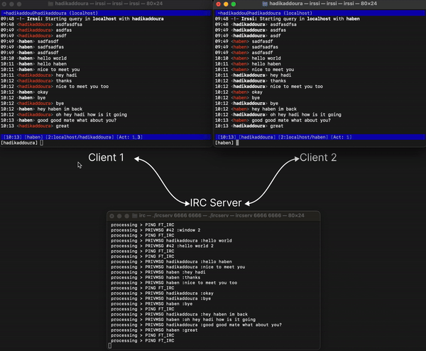
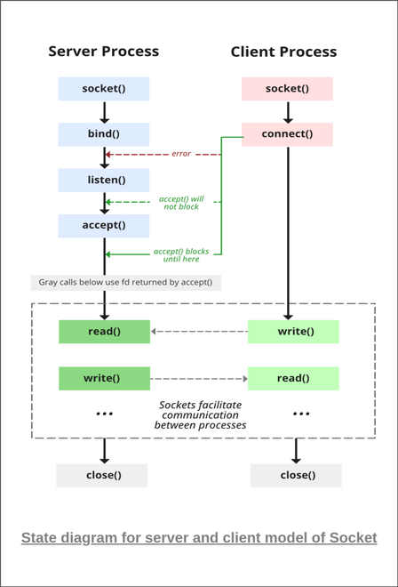

  <h3 align="center">IRC: Internet Relay Chat</h3>
  Spin up servers, chat one-on-one or in groups, and connect through a real GUI client (irssi).
   
   

 

# IRC

An advanced 42 curriculum project: a fully functional IRC (Internet Relay Chat) server written from scratch in `C++`, without any modern networking libraries. Building it meant taking a deep dive into low-level network programming, the client-server model, non-blocking sockets, multiplexing with `poll`, and the quirks of the IRC protocol itself. The result is a server that any standards-compliant IRC client (like irssi) can connect to and chat through.

 

## Run it locally

#### Start a server:

- From the project root, run `make`
- Launch with `./ircserv 1234 1234`
- Argument format: `./ircserv <port_number> <server_password>`

#### Connect as a client (raw netcat):

- Open a new terminal
- Run `nc localhost 1234`
- Argument format: `nc <host> <port_number>`
- Authenticate with `PASS 1234`
- Pick a nickname: `NICK <your_nick>`
- Register your user: `USER <username> <realname>`
- Open additional clients the same way and start chatting (see the command list below).

## Connect with a GUI (irssi)

#### Install irssi (macOS):
- `brew install irssi`

#### Joining the server:
- Start a server first (instructions above).
- In a new terminal, run `irssi`.
- Inside irssi, type `/connect localhost 2222 2222` and hit enter.

## Command list

| Command | Description |
| :-----------: | :----------- |
| Invite | `INVITE` adds a user to a channel. |
| Join | `JOIN` lets the client enter one or more channels, optionally using a key per channel. |
| Kick | `KICK` forcibly removes a user from a channel. |
| Kill | `KILL` terminates the connection between a given client and the server. Restricted to IRC operators. |
| Mode | `MODE` toggles options on a target. User modes: i, o. Channel modes: b, k, m, o, p, s, t, v. |
| Motd | `MOTD` returns the server's Message of the Day. |
| Names | `NAMES` lists the nicknames currently in a channel along with their membership prefixes. |
| Nick | `NICK` sets or changes the client's nickname. |
| Notice | `NOTICE` sends a message to a user or channel. Unlike `PRIVMSG`, automatic replies must never be triggered by a `NOTICE`. |
| Part | `PART` removes the client from the given channel(s). |
| Pass | `PASS` provides the connection password. If the server requires one, it must be sent before registration completes. |
| Ping | `PING` is used by clients or servers to check that the other side is still alive and to measure connection latency. |
| Privmsg | `PRIVMSG` sends a message to another user or to a channel. |
| Quit | `QUIT` ends a client's session. The server replies with an `ERROR` message and closes the socket. |
| Topic | `TOPIC` reads or changes a channel's topic. |
| User | `USER` is sent once at the start of a connection to register the username and real name. |

 
 

## Client / server connection graph

 

## Contributers

<table>

<tr>
    <td align="center" style="word-wrap: break-word; width: 150.0; height: 150.0">
        <a href=https://github.com/hadi14250>
            
             
            <b>Hadi Kaddoura</b>
        </a>
    </td>
    <td align="center" style="word-wrap: break-word; width: 150.0; height: 150.0">
        <a href=https://github.com/hbuivu>
            
             
            <b>hbuivu</b>
        </a>
    </td>
		<td align="center" style="word-wrap: break-word; width: 150.0; height: 150.0">
        <a href=https://github.com/virtualjensen>
            
             
            <b>Jensen</b>
        </a>
    </td>
</tr>
</table>

