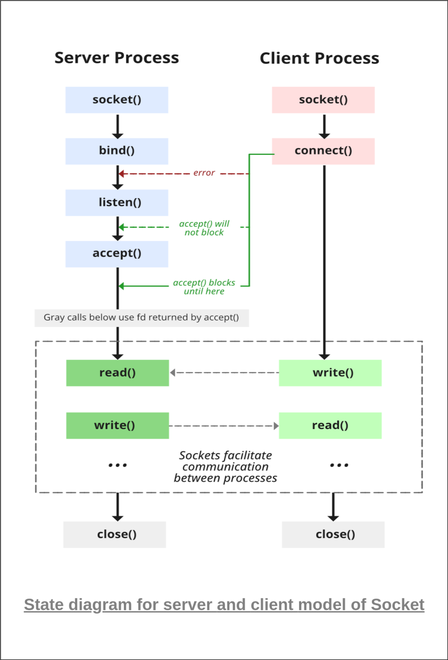

  <h3 align="center">IRC: Internet Relay Chat</h3>
  Create Servers, chat with indidviduals or groups, connect to a gui client (irssi).
   
   

 

# IRC

 A project in the advanced stages of the 42 curriculum. The goal is to implement a functional IRC (Internet Relay Chat) server, providing a deep dive into network programming and client-server architecture. Throughout the project, we adhered to strict requirements, building the server from scratch using `C++` without relying on modern networking libraries. This experience sharpened our understanding of sockets, concurrency, and the intricacies of the IRC protocol.

 

## How to run locally

#### To create a server:

- Go to root directory and run `make`
- Run `./ircserv 1234 1234`
- The areguments are: `./ircserv <<port_number>> <<server_password>>`

#### To Join the server as client:

- Open a new terminal (shell)
- Run `nc localhost 1234`
- The areguments are: `nc <<port_number>>`
- After joining server, type `PASS 1234` and `enter`.
- After joining server, type `PASS 1234` and `enter`.
- Type `NICK <<your_name>>` and `enter`
- Type `USER <<USER_NAME>> <<REAL_NAME>>` and `enter`
- Create other clients and chat with them (see full list of commands below)

## Connect to a GUI (irssi)

#### If you don't have irssi:
- Run `home brew install irssi`

#### Connecting:
- First, create a server (check instructions above)
- Run `irssi`
- will add instructions soon

## Command List

| Command | Description |
| :-----------: | :----------- |
| Invite | The `INVITE` command is used to invite a user to a channel. |
| Join | The `JOIN` command indicates that the client wants to join the given channel(s), each channel using the given key for it. |
| Kick | The `KICK` command can be used to request the forced removal of a user from a channel. |
| Kill | The `KILL` command is used to close the connection between a given client and the server they are connected to. `KILL` is a privileged command and is available only to IRC Operators. |
| Mode | The `MODE` command is used to set or remove options (or modes) from a given target. Our user modes : i, o. Our channel modes: b,k,m,o,p,s,t,v |
| Motd | The `MOTD` command is used to get the “Message of the Day” of the given server. |
| Names | The `NAMES` command is used to view the nicknames joined to a channel and their channel membership prefixes. |
| Nick | The `NICK` command is used to give the client a nickname or change the previous one. |
| Notice | The `NOTICE` command is used to send notices between users, as well as to send notices to channels. The difference between `NOTICE` and `PRIVMSG` is that automatic replies must never be sent in response to a `NOTICE` message.  |
| Part | The `PART` command removes the client from the given channel(s). |
| Pass | The `PASS` command is used to set a ‘connection password’. If set, the password must be set before any attempt to register the connection is made. |
| Ping | The `PING` command is sent by either clients or servers to check the other side of the connection is still connected and/or to check for connection latency, at the application layer. |
| Privmsg | The `PRIVMSG` command is used to send private messages between users, as well as to send messages to channels. |
| Quit | The `QUIT` command is used to terminate a client’s connection to the server. The server acknowledges this by replying with an `ERROR` message and closing the connection to the client. |
| Topic | The `TOPIC` command is used to change or view the topic of the given channel. |
| User | The `USER` command is used at the beginning of a connection to specify the username and realname of a new user. |

 
 

## Client Server Connection Graph

 

## Contributers

<table>

<tr>
    <td align="center" style="word-wrap: break-word; width: 150.0; height: 150.0">
        <a href=https://github.com/hadi14250>
            
             
            <b>Hadi Kaddoura</b>
        </a>
    </td>
    <td align="center" style="word-wrap: break-word; width: 150.0; height: 150.0">
        <a href=https://github.com/hbuivu>
            
             
            <b>hbuivu</b>
        </a>
    </td>
		<td align="center" style="word-wrap: break-word; width: 150.0; height: 150.0">
        <a href=https://github.com/virtualjensen>
            
             
            <b>Jensen</b>
        </a>
    </td>
</tr>
</table>

